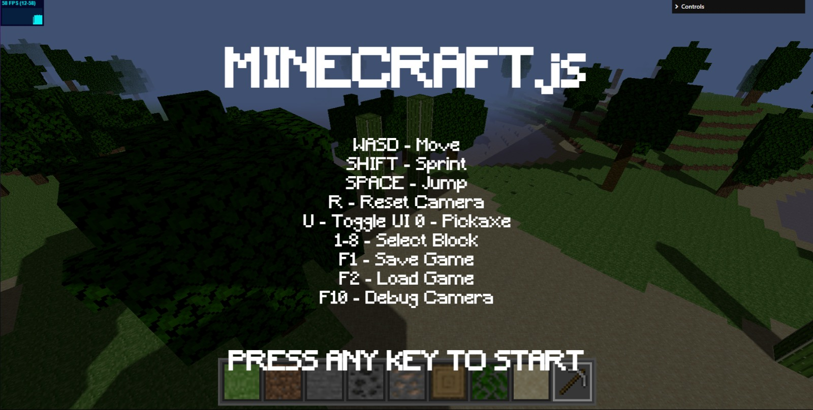

# Minecraft.js

A JavaScript-based Minecraft clone built with Three.js and Vite. Experience the classic Minecraft gameplay in your browser!



## 🎮 Features

- First-person 3D gameplay
- Block placement and destruction
- Multiple block types (grass, dirt, stone, ores, etc.)
- Basic world generation
- Save and load game state
- Debug camera mode
- Responsive controls

## 🚀 Getting Started

### Prerequisites

- Node.js (v18 or higher)
- npm or yarn

### Installation

1. Clone the repository:
```bash
git clone https://github.com/yourusername/minecraft-js.git
cd minecraft-js
```

2. Install dependencies:
```bash
npm install
```

3. Start the development server:
```bash
npm run dev
```

4. Build for production:
```bash
npm run build
```

## 🎯 Controls

- **WASD** - Move
- **SHIFT** - Sprint
- **SPACE** - Jump
- **R** - Reset Camera
- **U** - Toggle UI
- **0** - Pickaxe
- **1-8** - Select Block
- **F1** - Save Game
- **F2** - Load Game
- **F10** - Debug Camera

## 🛠️ Tech Stack

- [Three.js](https://threejs.org/) - 3D graphics library
- [Vite](https://vitejs.dev/) - Build tool and development server
- JavaScript (ES6+)

## 📁 Project Structure

```
minecraft-js/
├── public/
│   ├── textures/    # Block textures
│   ├── models/      # 3D models
│   └── fonts/       # Custom fonts
├── scripts/         # Game logic
├── index.html       # Main HTML file
├── style.css        # Styles
└── vite.config.js   # Vite configuration
```

## 🌐 Deployment

The project is configured for deployment on Vercel. The build process is handled automatically through the following scripts:

```json
{
  "scripts": {
    "dev": "vite --host 127.0.0.1",
    "build": "vite build",
    "preview": "vite preview --host 127.0.0.1",
    "predeploy": "npm run build",
    "deploy": "gh-pages -d dist"
  }
}
```

## 🤝 Contributing

Contributions are welcome! Please feel free to submit a Pull Request.

1. Fork the project
2. Create your feature branch (`git checkout -b feature/AmazingFeature`)
3. Commit your changes (`git commit -m 'Add some AmazingFeature'`)
4. Push to the branch (`git push origin feature/AmazingFeature`)
5. Open a Pull Request

## 📝 License

This project is licensed under the MIT License - see the [LICENSE](LICENSE) file for details.

## 🙏 Acknowledgments

- Inspired by Minecraft
- Built with Three.js
- Powered by Vite 